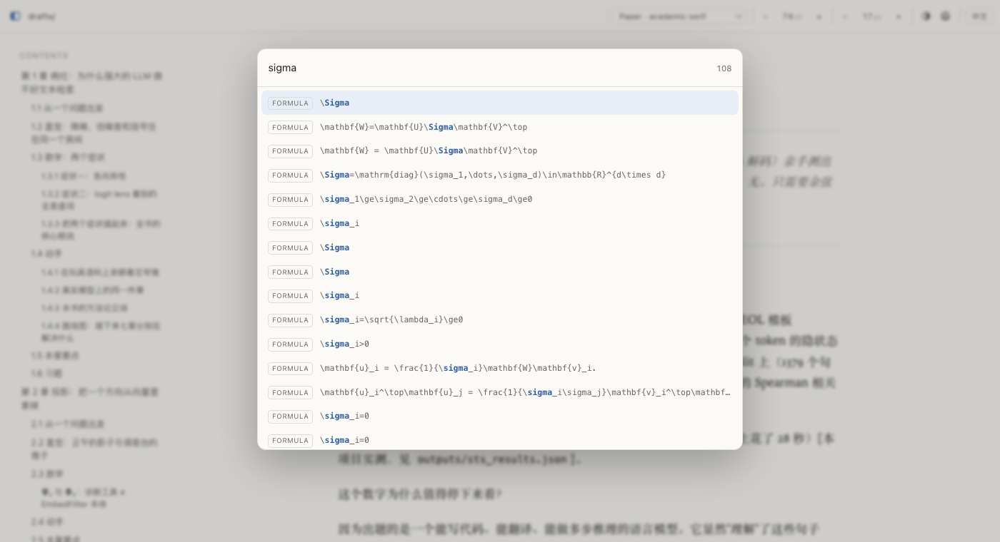
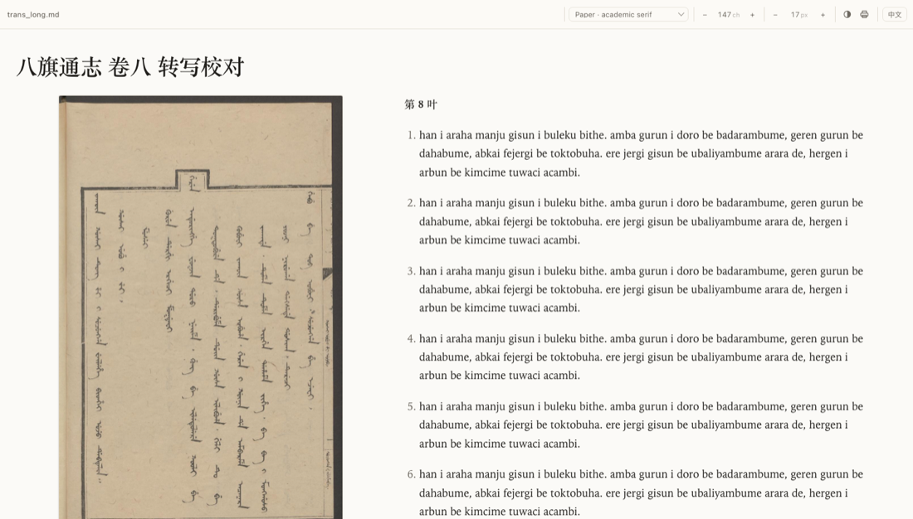

<h1 align="center">
  <br>
  quietmd
</h1>

<p align="center">
  A quiet Markdown reader for documents with math.<br>
  One self-contained HTML file, fully offline —<br>
  and if a formula didn't come out, it says so.
</p>

<p align="center">
  <a href="https://github.com/chenzhan4321/quietmd/actions/workflows/verify.yml"></a>
  
  <a href="README.zh-CN.md">中文说明</a>
</p>

<p align="center"></p>

```console
$ quietmd paper.md            # render and open; writes paper.html next to the source
$ quietmd paper.md -w         # live preview, reloads on save
$ quietmd paper.md --check    # list any formula that didn't render; exit 0 if all fine
```

## Why

I write papers with a lot of mathematics, and Markdown editors kept mangling it. In Typora
and iA Writer I ran into the same things over and over: subscripts vanishing, multi-line
equations collapsing into one, whole `align` blocks rendering as literal text.

It's an ordering problem, and most editors share it: **they run the Markdown parser first,
then hand the result to the math renderer.** By the time KaTeX or MathJax sees your
formula, Markdown has already edited it — it read the `_` in `a_i b_i` as an emphasis
marker and ate one of the backslashes in `\\`.

quietmd reverses the order. It **lifts every formula out of the source before Markdown
runs**, leaving a placeholder behind, so the parser never sees a single LaTeX character.
The formulas then go back in untouched. `$` plays no part in MathJax's scan either, so
`it cost $200, then another $1500` can't turn into an equation.

## It tells you when a formula didn't come out

This is the part I actually care about. Renderers fail quietly: MathJax can throw and skip
an element, leaving raw LaTeX in the page that looks exactly like text you meant to write.
You scroll straight past it.

So quietmd doesn't ask the renderer whether it worked — after rendering it **checks every
formula itself**:

<p align="center"></p>

Red box: the formula couldn't be parsed at all, usually an unbalanced brace. Orange
underline: one command was unknown but the rest rendered, so you can still read it. Either
way a note appears in the corner, and clicking it walks you through them one by one.

Before submitting a manuscript, sweep the whole thing from the shell:

```console
$ quietmd paper.md --check
paper.md: 2270 formulas, 0 won't render, 0 with unknown commands
  All good.
```

Exit code is 0 only when everything rendered, so it fits in a script.
It also cross-checks the manuscript itself, which needs no browser at all:

```console
$ quietmd paper.md --check
  [dangling reference] \eqref{eq:missing} → no matching \label
  [duplicate label] \label{eq:dup} appears 2 times, numbering will be wrong
  [unused macro] \NeverUsed defined but never used
```

A `\eqref` pointing at a label that doesn't exist renders as `???` and is easy to scroll
past; a label written twice silently breaks the numbering from there on.


Under `-w` your reading position is also written next to the document as
`.quietmd-<name>.json`, so if that folder is in Dropbox or a repo you carry on from the
same place on another machine. It records which section you had reached, not a pixel
offset — change the type size or the style, or add paragraphs above, and it still points
at the same place. Opening a static HTML can't write files, so there it stays in
localStorage as before.

## Finding things

`⌘F` can't find formulas — they're SVG, and in a book with a couple of thousand of them
"where was that expression with sigma_i" has no answer. Press `/` or `⌘K`:

<p align="center"></p>

It searches body text, headings **and the LaTeX source of every formula**. Type a number
and it jumps to that equation — `2` finds equation (2) even when it lives inside an
`align` block that carries several numbers. `↑`/`↓` and `Enter` to move and go.

A contents list written into the document itself becomes clickable: entries under a
heading called *Contents* (or 目录) that match a heading in the document are linked to it,
whether they're a bullet list or one line per paragraph. Entries that match nothing are
left as plain text. `[TOC]` on its own line expands into a full linked contents list.

## A directory as one book

A run of numbered files usually *is* one thing — chapters of a book, sections of a paper.
Point quietmd at the directory:

```console
$ quietmd drafts/
drafts/: joined 8 files in name order
  chapter_01_the_symptom.md
  ...
```

Files are joined in filename order (`chapter_01…08` is named that way for a reason) and
the sidebar becomes the structure of the whole book. Files beginning with `_` or `.` are
skipped — those are usually notes to the author rather than the text. Use
`--exclude 'full_*.md'` to skip anything else; the file list is always printed, because
a directory that also holds a generated merge would otherwise count everything twice.

## Checking a transcription against the scan

```console
$ quietmd folio.md --facing
```

Each image is pinned beside the text that follows it: the scan stays put on the left while
the transcription scrolls on the right, and the next page takes over when you reach it. No
more switching windows to compare a line against the original. The image is capped at one
screen so a pinned page is never half out of view; click it for full size.

<p align="center"></p>

## Comparing two drafts

```console
$ quietmd new.md --diff old.md
```

**Formulas are compared whole, not character by character.** A character-level diff
shreds a long equation into red and green confetti; what you actually want to know is
which formulas changed. Two formulas that differ only in whitespace are *not* a change —
maths ignores spaces, so `\langle u, v\rangle` and `\langle u,  v \rangle` set
identically. Changing `u_i` to `v_i` is. The header counts both, so you can see at a
glance how much of a revision touched the mathematics.

## Straight to PDF

```console
$ quietmd drafts/ --pdf -s book
drafts.pdf  (73 pages, 4.2 MB, book layout)
```

No LaTeX, no print dialog. The style you pick *is* the page design, so the same source
gives you a LaTeX-looking article, a book, or a double-spaced typescript to mark up.
Toolbar, sidebar and the corner note are left out, headings don't get stranded at the foot
of a page, and the page is white — a style's background colour is a screen thing.

## Styles

Eight, all embedded in the page — pick from the dropdown or press `s`. Each is modelled on
something real rather than invented.

| | based on |
|---|---|
| `paper` | warm white, serif, side contents (default) |
| `latex` | LaTeX `article` — justified, indented, centred headings |
| `book` | traditional book setting, cream page |
| `tufte` | [tufte-css](https://edwardtufte.github.io/tufte-css/) |
| `medium` | Medium article pages |
| `github` | GitHub README |
| `swiss` | Swiss/International style |
| `manuscript` | typescript, double-spaced, for proofreading |

<p align="center">
  
  
  
</p>

The toolbar shows real typographic parameters — characters per line and body size — rather
than "narrow / medium / wide". Interface is English by default, with a `中文` button.

## Install

Needs [uv](https://docs.astral.sh/uv/). A Chromium-based browser is required only for
`--check`; ordinary reading works in any browser.

```console
$ git clone https://github.com/chenzhan4321/quietmd.git
$ cd quietmd && ./install.sh
```

On macOS, `./install.sh --macos-app` also makes double-clicking a `.md` open it here.

To remove it again: `./uninstall.sh` (add `--cache` to drop the render cache too).

MathJax (2.2 MB) isn't in the repository — the first run fetches it once, and nothing
touches the network after that.

## Check it yourself

Don't take any of the above on trust:

```console
$ sh verify.sh
```

It renders a torture-test document, runs MathJax for real in headless Chrome, and verifies
15 things — subscripts surviving the parser, `\\` line breaks, bare `\begin{align}`,
`\label`/`\eqref` numbering and cross-references, `\newcommand` persisting across formulas,
currency amounts *not* becoming math, code blocks left alone. Expected: 15 passes and
**exactly one formula failing** — the test document breaks one on purpose. If that failure
ever disappears, the error detection is what broke.

<details>
<summary>More detail</summary>

**Inline `$…$`** follows pandoc's conservative rule: no whitespace after the opening `$`,
none before the closing one, no digit right after it, no blank line inside. Anything else
is just a dollar sign. The scan skips code blocks, so `echo $PATH` is never math.

**Math** — `$…$` `$$…$$` `\(…\)` `\[…\]`, all amsmath environments, `\newcommand`
persisting across formulas, `\label`+`\eqref` with automatic numbering and clickable
cross-references, and every MathJax extension package.

**Markdown** — GFM tables, strikethrough, task lists, footnotes, definition lists, YAML
front matter, Pygments highlighting, autolinks.

**Reading** — side contents following your scroll, chapters foldable (the one you are
reading opens itself), progress bar, light/dark following the
system, long equations scrolling horizontally, double-click a formula to copy its LaTeX,
print stylesheet, returns to where you were on reload. Keys: `j`/`k` scroll, `g`/`G`
top/bottom, `t` theme, `s` style, `h` contents, `l` language, `[` `]` width.

**Output** — lands next to the source (`paper.md` → `paper.html`). If a file of that name
already exists and quietmd didn't write it, it writes `paper.quietmd.html` instead and
leaves yours alone. Images are inlined, so the HTML really is one file you can send.

**On other tools** — pandoc's math is correct: its Markdown reader understands math
natively instead of post-processing, so it never makes the mistakes above. Same for VS
Code's Markdown Preview Enhanced, Mathpix's markdown-it, and Quarto. Two differences:
pandoc doesn't enable `tags:'ams'` by default, so `\label`/`\eqref` cross-references don't
work; and none of them tell you when a formula didn't render.

</details>

## License

MIT. MathJax is fetched at runtime and is not part of this repository
([Apache-2.0](https://github.com/mathjax/MathJax/blob/master/LICENSE)).
The `tufte` style follows [tufte-css](https://github.com/edwardtufte/tufte-css) (MIT).
