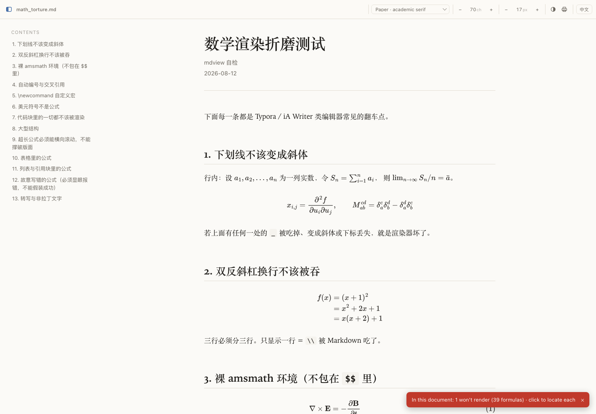
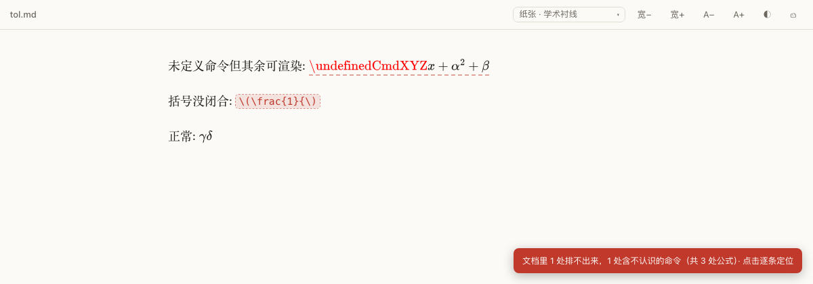
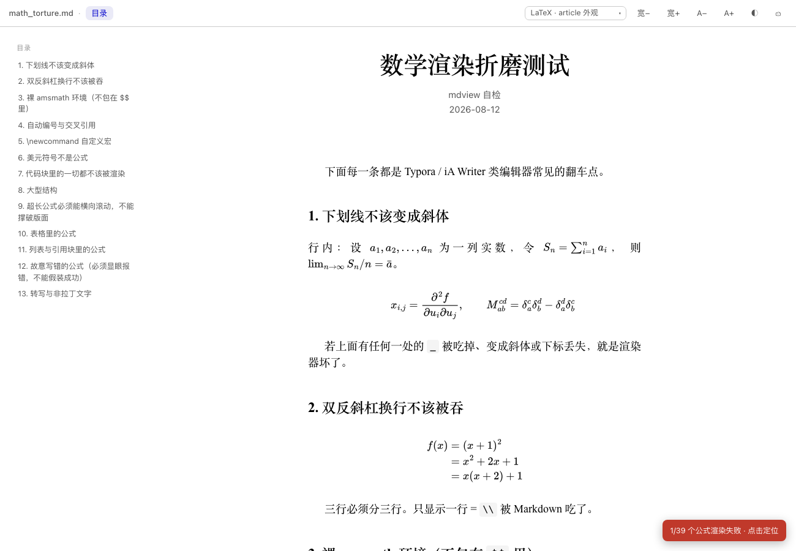
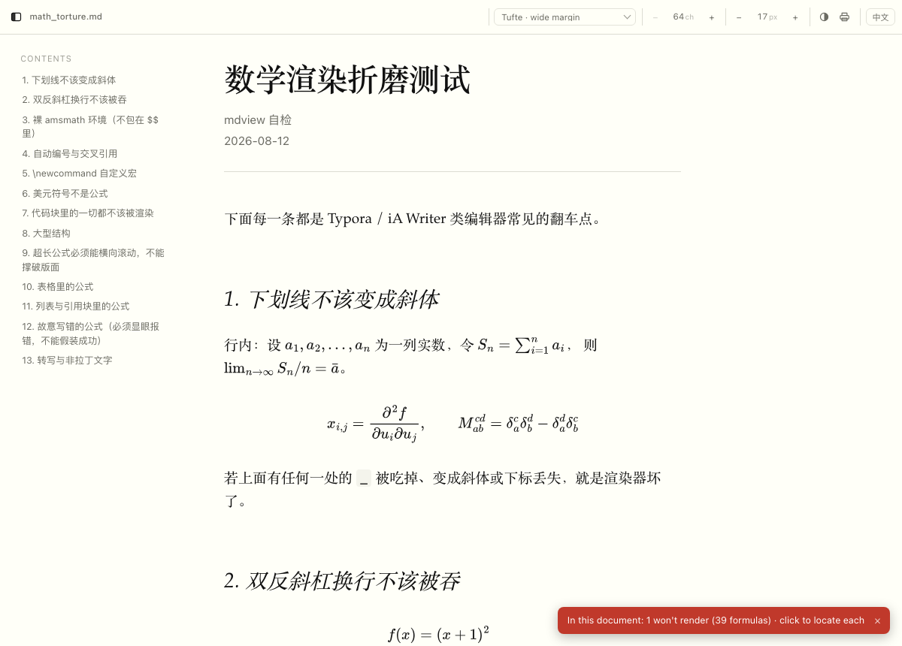
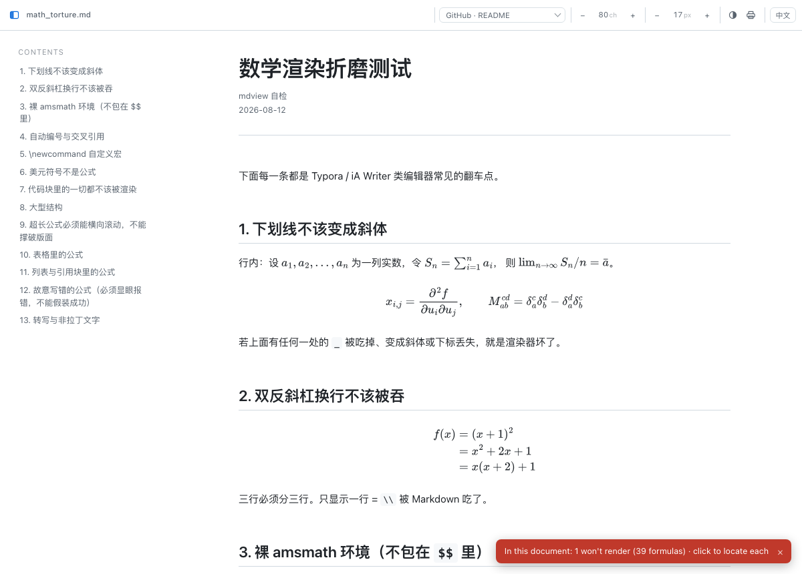

<h1 align="center">
  <br>
  quietmd
</h1>

<p align="center">
  <a href="https://github.com/chenzhan4321/quietmd/actions/workflows/verify.yml"></a>
  
</p>

<p align="center">
  A quiet Markdown reader for documents with math.<br>
  Renders to one self-contained HTML file, works fully offline,<br>
  and <b>tells you when a formula didn't come out right</b>.
</p>

<p align="center"><a href="README.zh-CN.md">中文说明</a></p>

<p align="center"></p>

```console
$ quietmd paper.md            # render and open; writes paper.html next to the source
$ quietmd paper.md -w         # live preview, reloads on save
$ quietmd paper.md -o out.html  # just the file — mail it to someone, it works offline
$ quietmd paper.md --check    # list formulas that failed to render; exit 0 if all fine
```

---

## Why this exists

Markdown editors keep getting math wrong, and they get it wrong in the same way:
**they run the Markdown parser first, then hand the result to the math renderer.**
By the time KaTeX or MathJax sees your formula, Markdown has already edited it.

| You wrote | What the Markdown parser did | What you got |
|---|---|---|
| `$a_i b_i$` | read `_i b_` as emphasis markers | subscripts gone, a chunk turned italic |
| `\\` (line break) | ate one backslash as an escape | a multi-line equation collapsed into one line |
| `\begin{align}` | didn't recognise it, treated it as a paragraph | the whole block rendered as literal text |
| `\eqref{eq:1}` | passed it through | MathJax 3 doesn't scan outside delimiters, so nothing happens |

quietmd goes the other way: **lock the math first, render, then put it back.**

1. Scan the source once and lift out every piece of math (`$…$`, `$$…$$`, `\(…\)`,
   `\[…\]`, bare `\begin{align}`…), replacing each with a private-use-area placeholder.
   The scan **skips code blocks and inline code**, so the `$` in `echo $PATH` is never math.
2. Hand the placeholder-only text to the Markdown parser. It never sees a single LaTeX character.
3. Put the math back verbatim and give it to MathJax 3 (SVG output, no external fonts).
   `$` plays no part in MathJax's own scan — so `it cost $200, then another $1500`
   can never turn into an equation.

Inline `$…$` follows pandoc's conservative rule: no whitespace after the opening `$`,
none before the closing `$`, no digit right after the closing `$`, no blank line inside.
Anything else is just a dollar sign.

## Errors are never silent — but they're not over-punished either

MathJax can fail in three ways, and the dangerous one is that it **throws and skips the
element entirely**, leaving the raw LaTeX sitting in the page with no indication at all.
It looks exactly like text that was meant to be text. So quietmd doesn't rely on MathJax
to report its own failures. After rendering it **checks every math slot for an actual
`mjx-container`**, and sorts what it finds into two levels:

| | when | on the page |
|---|---|---|
| **won't render** | a syntax error — unbalanced braces and the like | red dashed box showing the raw LaTeX |
| **unknown command** | a typo or a macro from a package you don't have, but **the rest of the formula renders fine** | orange dashed underline, formula still readable |

<p align="center"></p>

Two levels because the punishment shouldn't be uniform. In
`\undefinedCmd{x} + \alpha^2 + \beta` only one command is unknown; killing the whole
line would hide α² too. So MathJax's `noundefined` package stays enabled — it renders
unknown commands as red text and lets the rest through — and since that red text carries
`fill="red"`, the check still catches it. Nothing goes silent. `noerrors` **is** removed:
it disguises a broken formula as ordinary prose, which is the one thing that must never happen.

The wording points at **the document**, not at the reader — "render failed" makes people
think the tool is broken, when nearly always the formula itself has a typo.

To sweep a whole manuscript before submitting:

```console
$ quietmd paper.md --check
paper.md: 3 formulas, 1 won't render, 1 with unknown commands
  [won't render] 1. \frac{1}{
  [unknown command] 1. \undefinedCmdXYZ{x} + \alpha^2 + \beta
```

That's not a static scan — it runs MathJax for real in headless Chrome and checks each
slot. Exit code is 0 only when everything rendered, so it drops straight into a script.

## Honest comparison with pandoc

Same torture-test document, both rendered and then actually run through MathJax in
headless Chrome (`pandoc 3.9.0.2`, `--standalone --embed-resources --mathjax=file://…`):

| | pandoc | quietmd |
|---|---:|---:|
| formulas rendered | 38 | 38 |
| `\label` producing equation numbers | 0 | 3 |
| `\eqref` producing clickable references | 0 | 6 |
| broken formulas flagged | 0 | 1 |

**pandoc's math parsing is flawless** — its Markdown reader understands math natively
rather than post-processing, so it never makes the mistakes in the table above. If you
only need correct math, pandoc has had you covered for years. Two things differ: pandoc
doesn't enable `tags:'ams'` by default, so `\label`/`\eqref` cross-references don't work;
and the deliberately broken formula was quietly disguised as prose by MathJax's
`noundefined`, with no warning.

The same goes for VS Code's Markdown Preview Enhanced, Mathpix's markdown-it, and Quarto —
they all get the math right. What I couldn't find anywhere is **a reader that tells you
when a formula didn't come out.** That's the part worth having.

## Typography

Eight styles, all embedded in the page — pick from the dropdown or press `s` to cycle.
Your choice is remembered. `--style` only sets the initial one. Switching styles cannot
change the rendering: all eight produce identical formula counts.

| | based on | |
|---|---|---|
| `paper` | — | warm white, serif, side ToC (default) |
| `latex` | LaTeX `article` | narrow measure, justified, indented paragraphs, centred headings; prefers Latin Modern / CMU if you have MacTeX |
| `book` | traditional book setting | cream page, indented paragraphs, centred headings, no sidebar |
| `tufte` | [tufte-css](https://edwardtufte.github.io/tufte-css/) | `#fffff8`, Palatino, italic non-bold headings, text set left with a wide right margin |
| `medium` | Medium article pages | serif body, heavy sans headings, large type, loose leading |
| `github` | GitHub README | system sans, ruled headings, grey rounded code blocks |
| `swiss` | Swiss/International style | sans, heavy rules between sections, strong hierarchy |
| `manuscript` | typescript | monospace, double-spaced, for proofreading and margin notes |

<p align="center">
  
  
  
</p>

Two adaptations specifically for CJK text, both found by looking at screenshots rather
than by reasoning: `latex` adds `text-justify:inter-word`, because Chinese has no
inter-word spaces and plain justification stretches the gaps *between characters*;
`tufte` adds `font-synthesis:style none`, because Chinese fonts have no true italic and
the browser's synthetic slant is ugly — now Latin gets real italics and Chinese stays upright.

## Everything else

**Math** — `$…$` `$$…$$` `\(…\)` `\[…\]`, all amsmath environments, `\newcommand`
(persists across formulas), `\label` + `\eqref` with automatic numbering and clickable
cross-references, plus every MathJax extension package (mhchem, physics, mathtools…).

**Markdown** — GFM tables, strikethrough, task lists, footnotes, definition lists,
YAML front matter, Pygments highlighting, autolinks.

**Reading** — side ToC that follows your scroll, progress bar, light/dark following the
system (`t` to override), font size, page width in four steps (`[` / `]`), long equations
scroll horizontally with a fade hint, double-click any formula to copy its LaTeX,
print/PDF stylesheet, returns to where you were on reload.

**Output** — the HTML lands next to the source file (`paper.md` → `paper.html`), so it's
easy to find and easy to hand to someone. If a file of that name already exists and
wasn't written by quietmd, it writes `paper.quietmd.html` instead and never touches yours;
if the directory isn't writable it falls back to `~/.cache/quietmd/`. Images are inlined
as base64 so the HTML really is a single file; `<script>`/`<iframe>` in the source are
stripped; MathJax is embedded, so nothing touches the network after the first run.
You'll probably want `*.html` in your `.gitignore`.

**Keys** — `j`/`k` scroll · `g`/`G` top/bottom · `t` theme · `s` style · `h` ToC ·
`[` `]` width · `⌘F` finds LaTeX source too.

## Install

Needs [uv](https://docs.astral.sh/uv/) (handles the Python dependencies) and a
Chromium-based browser (only for `--check` and `verify.sh`; ordinary viewing works
in any browser).

```console
$ git clone https://github.com/chenzhan4321/quietmd.git
$ cd quietmd
$ ./install.sh
```

MathJax (2.2 MB) isn't in the repository — the first run downloads it once, with mirror
fallback and a size check, and everything is offline from then on.

**macOS: double-click a `.md` to open it here**

```console
$ ./install.sh --macos-app
```

This builds an AppleScript app (only those can receive Finder's "open document" event),
declares the Markdown document types, and — if you have `duti` — makes it the default
handler. Note `duti -x md` caches its answer and may keep showing the old app; the real
test is to double-click a `.md` and see whether `~/.cache/quietmd/` gets a new HTML file.

To hand `.md` back to another app: `duti -s <bundle id> net.daringfireball.markdown all`.

## Verifying it works

Don't take the claims above on faith — there's a script:

```console
$ zsh verify.sh
```

It renders a torture-test document, runs MathJax for real in headless Chrome, and checks
15 things: subscripts surviving the Markdown parser, `\\` line breaks, bare `\begin{align}`,
`\label`+`\eqref` numbering and cross-references, `\newcommand` persisting across formulas,
currency amounts *not* becoming math, code blocks left alone, no placeholder leakage,
MathJax actually embedded. Expected result: 15 passes, and exactly one formula failing —
the one the test document breaks on purpose. If that failure ever disappears, the error
detection itself has broken.

## License

MIT — see [LICENSE](LICENSE).

MathJax is downloaded at runtime and is not part of this repository; it is
[Apache-2.0](https://github.com/mathjax/MathJax/blob/master/LICENSE) licensed by the
MathJax Consortium. `tufte` style is modelled on
[tufte-css](https://github.com/edwardtufte/tufte-css) (MIT).
